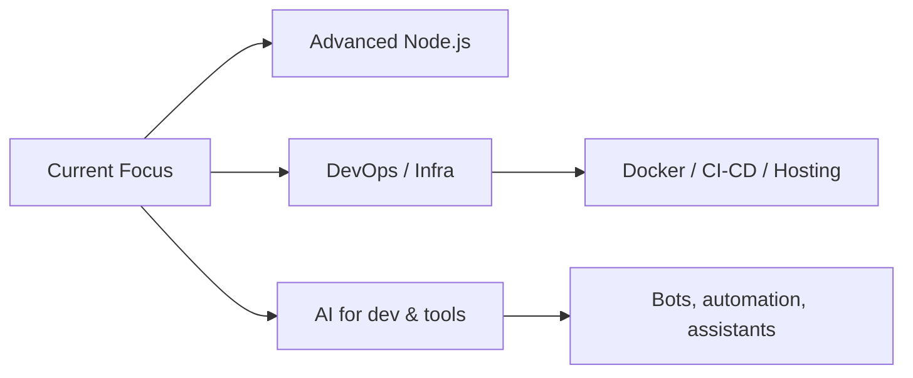

# fait moi un fichier markdown

```md
<!-- Header -->
<div align="center">
  <h1>Sasha DA SILVA (@C4ptainF0xy)</h1>
  <p>
    🚀 Full-Stack Developer · 🎮 Game Server Engineer · 💼 Prismodev Founder
  </p>
  <p>
    Étudiant en Bachelor Développeur Web Fullstack à CODA Orléans (B1 → B2, alternance 2026)
  </p>
</div>

---

<!-- About Me -->
<div align="center">

| 👨‍💻 Developer | 🎓 Journey | 💖 Passions |
| --- | --- | --- |
| **Sasha DA SILVA** (@C4ptainF0xy) | **CODA Orléans** – Bachelor Web Fullstack | **Prismodev** – Web & Game Hosting |
| Full-Stack Dev (React / Node.js) | 3 ans de dev web | Rhythm games, FNF, NotITG |
| Game Server Engineer | 15 ans de batterie | AI & tooling pour dev |

</div>

---

## ⚙️ Tech Arsenal

<div align="center">

### 🎯 Core Stack


### 💻 Web & Game


### 🛠️ Infra & Tools


</div>

---

## 🚀 Featured Projects

<div align="center">

| 🤖 Pixela Bot | 🏢 Prismodev Host |
| --- | --- |
| Bot Discord avancé en **Node.js** (modération, niveaux, économie, IA). | Plateforme d’hébergement de serveurs gaming automatisée (**React**, **Node.js**, **Stripe**, **Pterodactyl**). |
| API REST + Sequelize / SQL, système premium Stripe, hébergement 24/7. | Dashboard client, marketplace, auth JWT/2FA, provisioning automatique. |

| 🟢 FCCKingdom Launcher | 🎮 QT Extended Mod |
| --- | --- |
| Lanceur Minecraft en **Rust** pour le serveur FCCKingdom : mises à jour, configs, skins, auth Microsoft. | Mod étendu pour **Friday Night Funkin’** avec **HaxeFlixel**, contenu custom & tooling. |

</div>

---

## 📚 Learning Journey




---

## 🎯 Objectif 2026

- 🔍 Cherche une **alternance Fullstack** (React / Node.js / REST / DevOps)
- 🕒 Rythme : **3 semaines entreprise / 1 semaine école** (CODA B2, dès septembre 2026)
- 🏙️ Localisation : Paris / Orléans / remote partiel

---

## 🌐 Let’s Connect

<div align="center">

[](https://prismodev.fr)  
[](https://www.linkedin.com/in/sasha-dasilva)  
[](https://discordapp.com/users/1195101621143740509)  
[](https://github.com/C4ptainF0xy)

</div>
```
<span style="display:none">[^1][^2]</span>

<div align="center">⁂</div>

[^1]: CV_DASILVA_SASHA_B1-B.2pdf.pdf
[^2]: Blanc-violet-moderne-CV-francais-document-A4-1.pdf```

