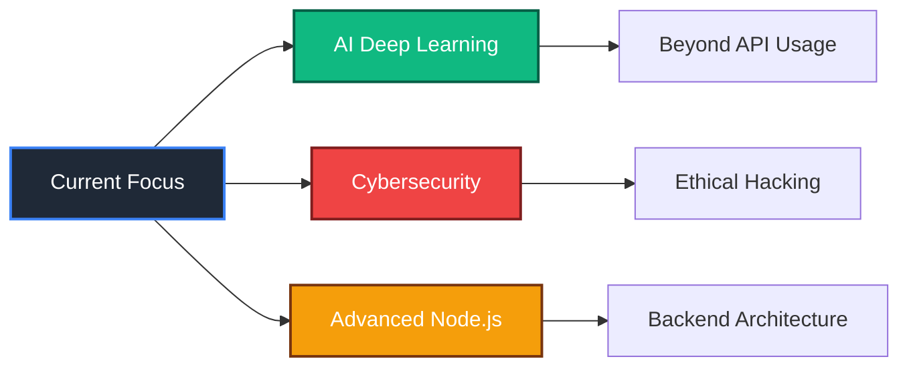

<!-- Header with GIF Background -->

  

    

      <h1 style="color: white; font-size: 45px; margin: 0; text-shadow: 2px 2px 4px rgba(0,0,0,0.5);">Sasha DA SILVA</h1>
      
@C4ptainF0xy | Full-Stack Developer & Game Server Engineer

    

  

<!-- Typing Animation -->

  
  
  

<!-- About Me Section -->

   
  
  <table>
    <tr>
      <td align="center" width="33%">
        <h3>👨‍💻 Developer</h3>
        
<strong>Sasha DA SILVA</strong> 
        <i>@C4ptainF0xy</i>  
        🚀 Full-Stack Developer 
        🎮 Game Server Engineer 
        💼 Business Owner

      </td>
      <td align="center" width="33%">
        <h3>🎓 Journey</h3>
        
<strong>CODA Orléans</strong> 
        Computer Science (1/5)  
        🥁 15 years drumming 
        💻 3 years web dev 
        🔒 Next: Cybersecurity

      </td>
      <td align="center" width="33%">
        <h3>💖 Passions</h3>
        
<strong>Prismodev</strong> 
        Company Founder  
        🎵 NotITG 
        🎤 Friday Night Funkin' 
        🤖 AI & Deep Learning

      </td>
    </tr>
  </table>
  

 

<!-- Tech Stack Section with Animated Icons -->
<h2 align="center">

Tech Arsenal

</h2>

### 🎯 Core Stack

### 💻 Web Technologies

### 🛠️ Tools & Infrastructure

 

<!-- Projects Section -->
<h2 align="center">

Featured Projects

</h2>

<table>
  <tr>
    <td align="center" width="50%">
      <h3>🤖 Pixela Bot</h3>
      
        
      <i>Advanced Discord bot with AI integration built with Node.js</i>
    </td>
    <td align="center" width="50%">
      <h3>🏢 Prismodev</h3>
      
        
      <i>Professional web development & game hosting services</i>
    </td>
  </tr>
  <tr>
    <td align="center" colspan="2">
      <h3>🎮 QT Extended Mod</h3>
      
        
      <i>Currently developing an extended mod for FNF with HaxeFlixel</i>
    </td>
  </tr>
</table>

 

<!-- Currently Learning Section -->
<h2 align="center">

Learning Journey

</h2>

 

<!-- Connect Section -->
<h2 align="center">
🌐 Let's Connect!
</h2>

 

<!-- Fun Facts Section -->
<h2 align="center">
🎯 Quick Facts
</h2>

| 🥁 Drummer | 🎮 Rhythm Gamer | 💼 Business Owner | 🌱 Always Learning |
|:---:|:---:|:---:|:---:|
| 15 years of experience | NotITG & FNF enthusiast | Running Prismodev | Cybersecurity is next |

 

<!-- Profile Views Counter -->

<!-- Footer Wave -->

<!-- Hidden Signature -->
<!-- Made with 💙 by C4ptainF0xy | "Nothing personal kid" -->
